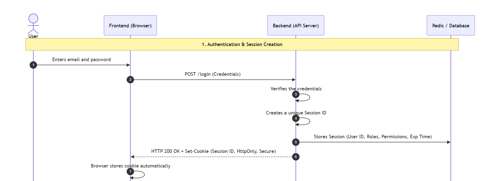
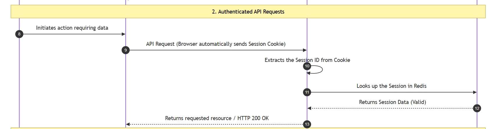
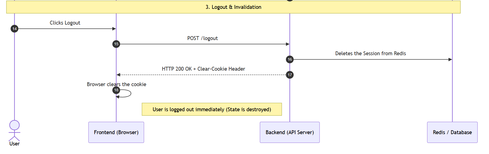
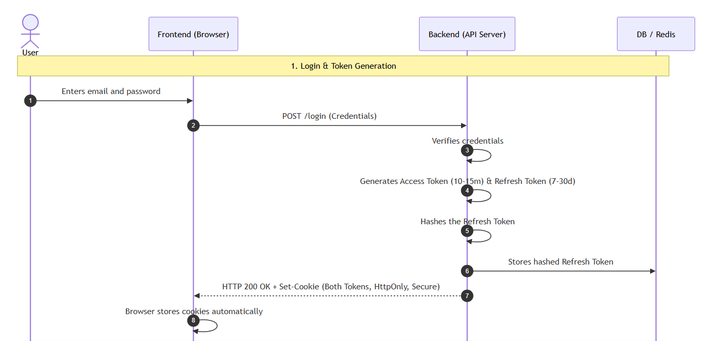
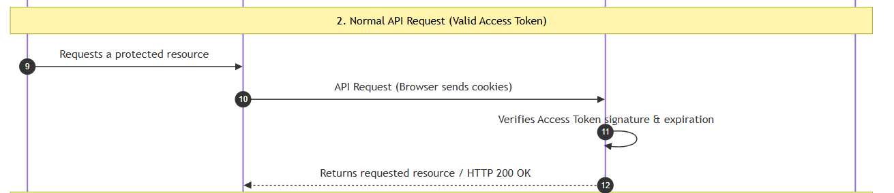
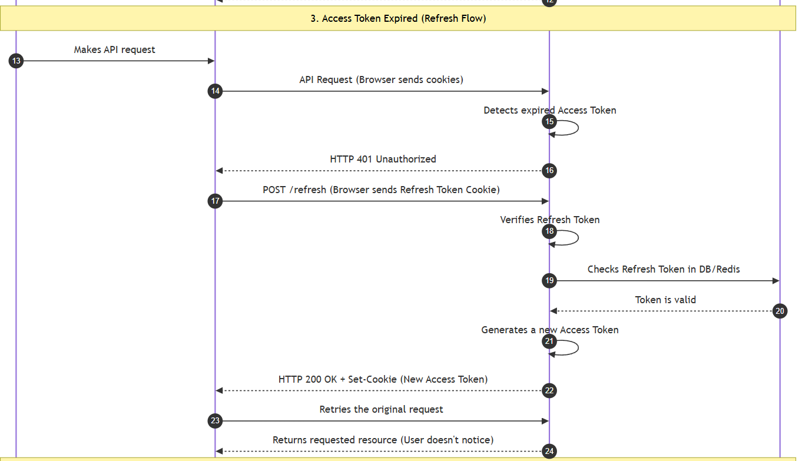
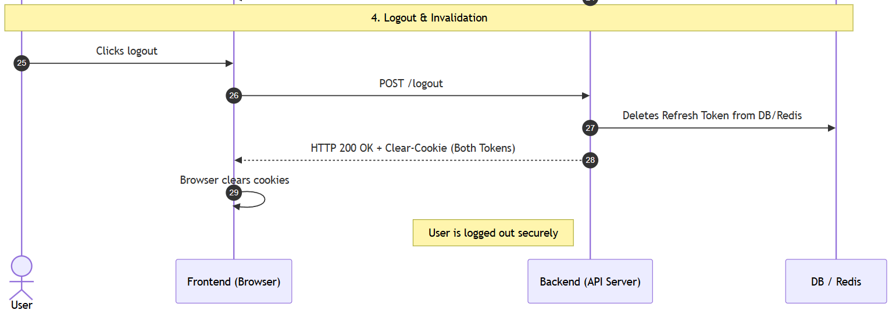

## Authentication & Authorization

Collected Knowledge

- What is Authentication & Authorization
- Concepts & PoC - Session, JWT, Access Token, Refresh Token rotation, OAuth3, RBAC, Simple role checks
- Google + Github Integration

## What is Authentication

- It asks "Who are you?" (Proves your identity).

## What is Authorization

- It asks "What are you allowed to do/access?" (Give you permission to use something)
- Common rules: RBAC or user lsits

## Authentication Types

### Session-Based - Stateful Authentication

- The server remembers every logged-in user.
- After successful login, the backend creates a Session.
- The session is stored in a centralized storage like Redis (most common) or a database.
- The browser only stores a Session ID inside an HttpOnly Cookie.
- Every request includes the Session ID automatically.
- The backend looks up the Session ID in Redis/Database to identify the user.
- This approach is called Stateful because the server maintains the authentication state.





---

<details>
    <summary>The Flow</summary>

User enters email and password.

- Frontend sends POST /login.
- Backend verifies the credentials.
- Backend creates a unique Session ID.
- Backend stores the Session in Redis (or Database).
- Session contains information like:
  - User ID
  - Roles
  - Permissions
  - Expiration time

- Backend sends a Session ID inside an HttpOnly Secure Cookie.
- Browser stores the cookie automatically.
- User makes another API request.
- Browser automatically sends the Session Cookie.
- Backend extracts the Session ID.
- Backend looks up the Session in Redis.
- If Session exists and is valid, the user is authenticated.
- Backend returns the requested resource.
- On logout:
  - Backend deletes the Session from Redis.
  - Backend clears the Cookie.
  - User is logged out immediately.

</details>

---

**Advantages**

- Very secure.
- Easy to invalidate sessions.
- Instant logout.
- Simple authorization flow.
- Works well for traditional monolithic applications.
- Easy to track active user sessions.

**Disadvantages**

- Every request requires a Redis/Database lookup.
- Backend must maintain session storage.
- Horizontal scaling requires shared session storage.
- More infrastructure is required.
- Not ideal for microservices.

#### PoC

Poc uses redis as database and API endpoints are `/signup`, `/login`, `/logout`.

`docker run --name local-redis -p 6379:6379 -d redis`

`docker exec -it local-redis redis-cli`

`KEYS *`

`GET key`

`HGETALL key`

Redis handles TTL automatically for you!

Here is how it works:

1. When you call redisClient.setEx(session:${sessionId}, 300, ...), Redis sets a 300-second (5-minute) timer on that key.
2. Once 300 seconds pass, Redis automatically deletes session:${sessionId} from database memory.
3. When the user makes a request after 5 minutes:
   - await redisClient.get(session:${sessionId}) returns null.
   - Your code sees null and knows the session has expired, returning a 401 Unauthorized response.

The above will be, if we implment `/profile` or some other endpoint where we check for the session id TTL.

### JWT Authentication - Stateless Authentication

- The server does not remember logged-in users through sessions.
- Authentication information is stored inside a JWT Access Token.
- Backend only verifies the JWT signature.
- No database lookup is required for normal API requests.
- A separate Refresh Token is used to obtain new Access Tokens.
- Refresh Tokens are stored securely in a database or Redis so they can be revoked.
- Both tokens are typically stored in HttpOnly Secure Cookies in production applications.

This approach is called Stateless because the backend does not store authentication state for Access Tokens.

A JWT is string composed of three distinct parts separated by dots (.): `Header`, `Payload`, and `Signature`.






#### The Flow

<details>
    <summary>The Flow</summary>

Login

- User enters email and password.
- Frontend sends POST /login.
- Backend verifies the credentials.
- Backend generates an Access Token (typically 10–15 minutes).
- Backend generates a Refresh Token (typically 7–30 days).
- Backend hashes the Refresh Token.
- Backend stores the hashed Refresh Token in Database or Redis.
- Backend sends both tokens as HttpOnly Secure Cookies.
- Browser stores the cookies automatically.

Normal API Request

- User requests a protected resource.
- Browser automatically sends the cookies.
- Backend verifies the Access Token signature.
- Backend checks token expiration.
- If valid, backend authenticates the user.
- Backend returns the requested resource.

Access Token Expired

- User makes an API request.
- Backend detects expired Access Token.
- Backend returns 401 Unauthorized.
- Frontend automatically calls POST /refresh.
- Browser sends the Refresh Token Cookie.
- Backend verifies the Refresh Token.
- Backend checks Refresh Token in Database/Redis.
- Backend generates a new Access Token.
- Backend sends the new Access Token Cookie.
- Frontend retries the original request.
- User receives the response without logging in again.

Logout

- User clicks logout.
- Frontend calls POST /logout.
- Backend deletes the Refresh Token from Database/Redis.
- Backend clears both cookies.
- User is logged out.

</details>

#### PoC

The JWT PoC demonstrates stateless authentication using short-lived Access Tokens combined with long-lived Refresh Tokens stored with rotation in Redis.

##### Token Payloads (JWT Claims)

Both Access and Refresh tokens contain the following decoded payload structure:

```json
{
  "email": "user@example.com",
  "role": "customer",
  "iat": 1723652400,
  "exp": 1723653300
}
```

- **Access Token**: Short-lived (`15m`), signed with `JWT_ACCESS_SECRET`.
- **Refresh Token**: Long-lived (`7d`), signed with `JWT_REFRESH_SECRET`.

---

##### Route Endpoints & Payload Details

###### 1. `POST /auth/jwt/signup`
Registers a new user and issues both tokens in HttpOnly cookies.

- **Request Body**:
  ```json
  {
    "email": "user@example.com",
    "password": "strongPassword123"
  }
  ```
- **Response (`201 Created`)**:
  - **Set-Cookie Headers**:
    - `accessToken=<jwt_token>; HttpOnly; Secure; SameSite=Strict`
    - `refreshToken=<jwt_token>; HttpOnly; Secure; SameSite=Strict`
  - **Response Body**:
    ```json
    {
      "message": "User registered and logged in successfully!",
      "user": {
        "email": "user@example.com",
        "role": "customer"
      }
    }
    ```

###### 2. `POST /auth/jwt/login`
Verifies credentials and issues both tokens in HttpOnly cookies.

- **Request Body**:
  ```json
  {
    "email": "user@example.com",
    "password": "strongPassword123"
  }
  ```
- **Response (`200 OK`)**:
  - **Set-Cookie Headers**:
    - `accessToken=<jwt_token>; HttpOnly; Secure; SameSite=Strict`
    - `refreshToken=<jwt_token>; HttpOnly; Secure; SameSite=Strict`
  - **Response Body**:
    ```json
    {
      "message": "Logged in successfully!",
      "user": {
        "email": "user@example.com",
        "role": "customer"
      }
    }
    ```

###### 3. `GET /auth/jwt/profile` (Protected Route)
Statelessly verified via `authenticateJWT` middleware without querying the database or Redis.

- **Request Headers / Cookies**:
  - `Cookie: accessToken=<jwt_token>` **OR** `Authorization: Bearer <jwt_token>`
- **Response (`200 OK`)**:
  ```json
  {
    "message": "Access token verified successfully (Stateless)",
    "user": {
      "email": "user@example.com",
      "role": "customer",
      "iat": 1723652400,
      "exp": 1723653300
    }
  }
  ```
- **Error Response (`401 Unauthorized` on expiry)**:
  ```json
  {
    "error": "Access token has expired. Please refresh your token.",
    "code": "TOKEN_EXPIRED"
  }
  ```

###### 4. `POST /auth/jwt/refresh` (Token Rotation)
Exchanges a valid Refresh Token for a brand new Access Token and a rotated Refresh Token.

- **Request**:
  - `Cookie: refreshToken=<jwt_token>` (or JSON Body: `{"refreshToken": "<jwt_token>"}`)
- **Response (`200 OK`)**:
  - **Set-Cookie Headers** (Rotated tokens):
    - `accessToken=<new_jwt_token>; HttpOnly; Secure; SameSite=Strict`
    - `refreshToken=<new_jwt_token>; HttpOnly; Secure; SameSite=Strict`
  - **Response Body**:
    ```json
    {
      "message": "Tokens rotated and refreshed successfully!",
      "user": {
        "email": "user@example.com",
        "role": "customer"
      }
    }
    ```
- **Error Responses**:
  - `401 Unauthorized` (`REFRESH_TOKEN_EXPIRED` or `REFRESH_TOKEN_REVOKED`)
  - `403 Forbidden` (`TOKEN_REUSE_DETECTED` – Invalidate all active sessions)

###### 5. `POST /auth/jwt/logout`
Revokes the stored Refresh Token in Redis and clears cookies.

- **Request**:
  - `Cookie: refreshToken=<jwt_token>`
- **Response (`200 OK`)**:
  - **Set-Cookie Headers**: Clears `accessToken` and `refreshToken` cookies
  - **Response Body**:
    ```json
    {
      "message": "Logged out successfully!"
    }
    ```

---

##### Redis Storage Schema:
- **User Record**: `user:<email>` (Hash containing `email`, `hasedPassword`, `role`)
- **Refresh Token Store**: `refreshToken:<email>` (String storing SHA-256 hash of current Refresh Token with TTL)

##### How Refresh Token Rotation Works:
1. When `/auth/jwt/refresh` is called, the backend verifies the signature and calculates the SHA-256 hash of the incoming token.
2. Backend looks up `refreshToken:<email>` in Redis:
   - If missing: Token expired or already revoked (Returns `401`).
   - If mismatch: Potential token reuse attack detected! The server revokes all sessions for that user immediately (Returns `403`).
   - If matched: Generates a new Access Token + new Refresh Token, updates Redis with the new hash, resets TTL, and sets updated cookies.

